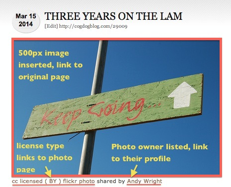

Flickr Creative Commons Attribution Helper
=========================
by Alan Levine http://cogdog.info/

Turns the laborious task of giving attribution of creative commons flickr photos into a one click operation.

WHY
-----

Darn you flickr! You make it so complex to give proper attribution for Creative Commons images. The photos available are a bag of gold-- [collection of creative commons licensed photos on flickr](http://flickr.com/creativecommon). Yet to use said images to create a blog post requires no less than 12 clicks and 4 copy/paste operations (estimate).

In 2009 I thought there should be an easier way and created the [first flickr cc attribution helper](http://userscripts.org/scripts/show/49395) as a Firefox Greasemonkey script.  The script detected if a given flickr photo was Create Commons licensed. If so, it inserted directly into the flickr page a cut and paste set of HTML that had everything to put into a blog post- the image code to display the photo, a link back to the original, and a display of the license, the photo owner, and links back.  It also provided a second text attribution string that could be used in documents or presentations.

[I later modified this script(http://cogdogblog.com/flickr-cc-helper/) to work as a [Chrome extension](https://chrome.google.com/webstore/detail/flickr-cc-attribution-hel/gcnphdhkhoepofbahkgfifigellgklbp). I've used this on literally hundreds of blog posts primarily on [CogDogBlog](http://cogdogblog.com/).

The pitfall of this approach was that it was completely dependent on knowing the structure of the flickr photo display page-- it is tied to the names of CSS  components. The flickr display format has changed 3 times since 2009.  Each change requiring a re-write of the script. Flickr does not provide any standard meta data on the page to identify the creative commons license, so getting details called for a set of XPATH parsing and Javascript gymnastics.
			
And finally the [update of the flickr site in March 2014 again rendered the script nonfunctional](http://cogdogblog.com/2014/03/26/new-flickr-trashes-creative-commons-attribution-helper/); it makes it imposible for me to update my scripts because much of the display is generated dynamically via complex YUI scripts; the information could not be easily parsed.

So I looked for another way.

Because attribution is love.
	
THE WAY FORWARD
-----
As an addition, when you make the bookmarklet tool, you have options to change the size of image used, so you can make use of flickr's different image widths (240, 500, 620, 800, 1024 px). Note that the larger sizes will not work if the original is of smaller dimensions.

This new version takes a different approach; a person interested  in using the tool intalls a [web browser bookmarklet](http://en.wikipedia.org/wiki/Bookmarklet). Just drag the link text on the blur button to your browser's bookmark bar.

Upon viewing a flickr photo, the bookmarklet spawns a window containing the one click copy attribution. If you are viewing a flickr photo licensed under creative commons, it will launch a small window with the one click copy/paste attribution fit for use in a blog post or a presentation.

Yes pop up windows are not elegant. Hopefully in the future I might be able to generate it as a light-box overlay. Or maybe you can fork this code, and do it for me?

THE EASY WAY VS THE CUSTOM WAY
-----

If you want to do basic attribution, you can use the [bookmarklet generating tool](http://cogdog.github.io/flickr-cc-helper/), and go off attributiing. It is powered by the helper tool page residing on github (I love you github).

The work of the attribution helper is done via an HTML page boosted with some jQuery code. The bookmarklet passes the unique flickr id (it's in the URL), and the tool page uses the [flickr api vis JSON](https://www.flickr.com/services/api/response.json.html) to get all of the information needed to build and display an attribution string.

			
If you would like to customize the attribution output in any way, or just prefer to run your own,  you can grab a copy of the attribtion helper on github here, fork and modify, and run on your own web server. It just needs to be available at a public web page. And you can still use the bookmarklet generator below to build your browser tool.

BOOKMARKLET MAKER
-----
Make one! http://cogdog.github.io/flickr-cc-helper/

TO RUN YOUR OWN
------------

You need place to put a HTML page at a public URL and you will need to get your own Flickr API key 

1. Get a flickr API key https://www.flickr.com/services/apps/create/apply
2. Edit the [cc-attributor.html](https://github.com/cogdog/flickr-cc-helper/blob/master/cc-attributor.html) to enter the API key value at

	var fpai = 'YOUR-OWN-APIKEY';

3. Upload to your web server in directory of your choice.  Check the URL. You know how to do this?
4. Use the [bookmarklet maker](http://cogdog.github.io/flickr-cc-helper/) use your own URL for a helperscript, and drag the link to your toolbar.
5. Attribute away

